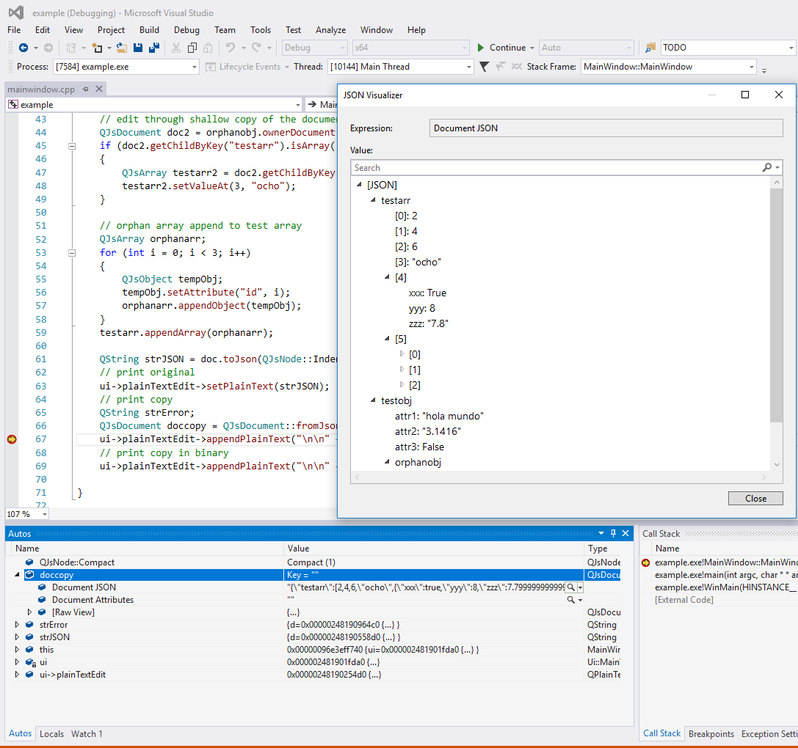

# QJsExplicit

A [Explicitly Shared](http://doc.qt.io/qt-5/qshareddatapointer.html#implicit-vs-explicit-sharing) implementation of the [JSON Support in Qt](http://doc.qt.io/qt-5/json.html) (QJsonDocument, QJsonObject, etc.).

The main advantage with respect to the original Qt implementation is that *Explicit Sharing* provides a more convenient (and direct) API for modifying parts of the underlying JSON. This comes of course at the cost of loosing thread-safety. Use at your own risk.

The *QJsExplicit* API is very similar to that of [Qt XML](http://doc.qt.io/qt-5/qtxml-module.html). The main classes are:

* QJsDocument

* QJsNode

* QJsObject

* QJsArray

It's usage is better explained with an example:

```c++
QJsDocument doc;

// create test object
QJsObject testobj = doc.createObject("testobj");
testobj.setAttribute("attr1", "hola mundo");
testobj.setAttribute("attr2", 3.1416);
testobj.setAttribute("attr3", false);

// create test array
QJsArray testarr = doc.createArray("testarr");
testarr.appendValue(2);
testarr.appendValue(4);
testarr.appendValue(6);
testarr.appendValue(8);

// create test array child object
QJsObject arrchildobj = testarr.createObject("whatever");
arrchildobj.setAttribute("xxx", true);
arrchildobj.setAttribute("yyy", 8);
arrchildobj.setAttribute("zzz", 7.8);

// orphan object append to test
QJsObject orphanobj;
orphanobj.setKeyName("orphanobj");
orphanobj.setAttribute("A", 1);
orphanobj.setAttribute("B", 2);
orphanobj.setAttribute("C", 3);
testobj.appendChild(orphanobj);

// edit through shallow copy of the document
QJsDocument doc2 = orphanobj.ownerDocument();
if (doc2.getChildByKey("testarr").isArray())
{
    QJsArray testarr2 = doc2.getChildByKey("testarr").toArray(); 
    testarr2.setValueAt(3, "ocho");                              
}                                                                

// orphan array append to test array
QJsArray orphanarr;
for (int i = 0; i < 3; i++)
{
    QJsObject tempObj;
    tempObj.setAttribute("id", i);
    orphanarr.appendObject(tempObj);
}
testarr.appendArray(orphanarr);

QString strJSON = doc.toJson(QJsNode::Indented);
// print original
ui->plainTextEdit->setPlainText(strJSON);
// print copy
QString strError;
QJsDocument doccopy = QJsDocument::fromJson(strJSON.toUtf8(), strError);
ui->plainTextEdit->appendPlainText("\n\n" + doccopy.toJson(QJsNode::Compact));
// print copy in binary
ui->plainTextEdit->appendPlainText("\n\n" + QString::fromStdString(doccopy.toBinaryData().toStdString()));
```

A possible output would be:

```json
{
    "testarr": [
        2,
        4,
        6,
        "ocho",
        {
            "xxx": true,
            "yyy": 8,
            "zzz": 7.7999999999999998
        },
        [
            {
                "id": 0
            },
            {
                "id": 1
            },
            {
                "id": 2
            }
        ]
    ],
    "testobj": {
        "attr1": "hola mundo",
        "attr2": 3.1415999999999999,
        "attr3": false,
        "orphanobj": {
            "A": 1,
            "B": 2,
            "C": 3
        }
    }
}
```

---

## Natvis File

When developing in Windows with Visual Studio (2015 or more recent), it is possible to see the JSON contents of an QJs class while debugging, as shown in the figure below:

> 

This can be achieved by adding the file:

```
./src/QJs.natvis
```

into the Visual Studio project by right clicking the project,  and selecting ```Add -> Existing Item...```.

For more information about Visual Studio Navis files visit [this link](https://msdn.microsoft.com/en-us/library/jj620914.aspx).

---

LICENSE is MIT.

Copyright (c) 2017 Juan Gonzalez Burgos
